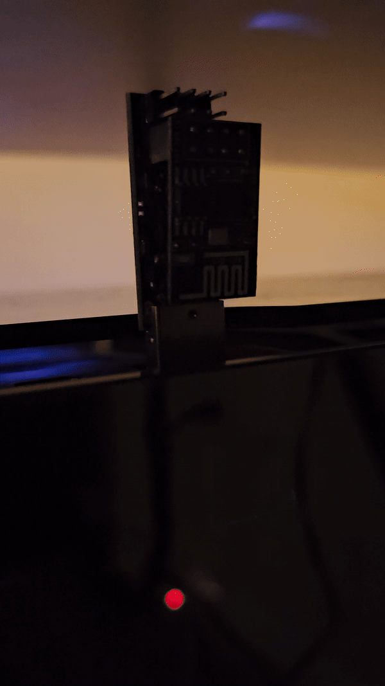
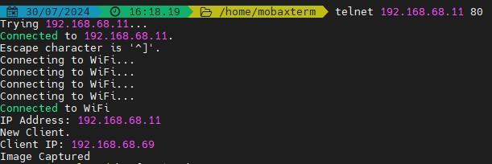

# 🔮 Pair an ESP01s with the OpenMV Camera 🔮
```
                                (    (        *                          
                                )\ ) )\ )   (  `                         
                            (   (()/((()/(   )\))(      )  (  (  (        
                            )\   /(_))/(_)) ((_)()\  ( /(  )\))( )\   (   
                            ((_) (_)) (_))   (_()((_) )(_))((_))\((_)  )\  
                            | __|/ __|| _ \  |  \/  |((_)_  (()(_)(_) ((_) 
                            | _| \__ \|  _/  | |\/| |/ _` |/ _` | | |/ _|  
                            |___||___/|_|    |_|  |_|\__,_|\__, | |_|\__|  
                                                        |___/
```

## Purpose
**Goal**: Use the power of an ESP to provide wifi for the OpenMV H7 R1 camera module. 


## Dependencies
**Hardware**
* [OpenMV H7 R1 Camera](https://www.adafruit.com/product/4478)
* [ESP01s](https://www.amazon.com/DIYmall-ESP8266-ESP-01S-Serial-Transceiver/dp/B00O34AGSU)
* [ESP Adapter](https://www.amazon.com/dp/B08F9X3M5J?psc=1&ref=ppx_yo2ov_dt_b_product_details)

**Software**
* Arduino IDE
* [Espressif ESP Adapter Driver](https://github.com/espressif/esptool/releases)
* [Flash Download Tools](https://www.espressif.com/en/support/download/all)
* [ESP01s Firmware](https://github.com/espressif/ESP8266_NONOS_SDK/releases) (used for the necessary bin files)

## Flashing & Programming the ESP01s
1. Ensure that the ESP01s can be detected within the Arduino IDE. Launch the IDE and go to **File > Preferences > Additional Board Manager URLs** and add
this link: https://forum.arduino.cc/t/esp8266-cannot-detect-a-serial-port/937032 
Hit OK to continue. Open the Board Manager and search for `esp8266` and install it.
2. Connect your ESP01s to the ESP adapter. Insert into your PC. It should quickly flash blue a few times and then the LED will turn off completely. This is normal.
3. Launch the Flash Download Tool. Select the COM (located in the bottom left of the application).
    * Note, my serial port was COM3. You can always double check this by unplugging the ESP01s (it's fine to do so, it's not like a regular external drive that must be ejected..) and viewing which ports populate/disappear from this drop down.
4. Return to the Arduino IDE. We need to select the board we are working with. First go to **Tools > Port > "COM3"** to select our serial port. Then go to **Tools > Board > esp8266 > General ESP8266 Module**
5. Return to the Flash Download Tools application. Upload the following bin files (gathered from the ESP8266_NONOS_SDK repo) individually. You may use different memory addresses if you wish:
    * **\ESP8266_NONOS_SDK-3.0.6\bin\blank.bin @ 0xFB000**
    * **\ESP8266_NONOS_SDK-3.0.6\bin\boot_v1.7.bin @ 0xFC000**
    * **\ESP8266_NONOS_SDK-3.0.6\bin\at\512+512\user1.1024.new.2.bin @ 0x7E000**
    * **\ESP8266_NONOS_SDK-3.0.6\bin\esp_init_data_default_v08.bin @ 0x01000**
    * *Ensure that 40MHz, DOUT, DoNotChgBin are all selected.*
    Select START to upload the firmware.
6. Return to the Arduino IDE. Let's add a simple program that flashes the LED on the ESP01s for 1 second every second. To do this, go to **File > Examples > 01.Basics > Blink**
7. Select the arrow located in the top left of the IDE, to the right of the check-mark button. This will upload the program to the ESP01s. Wait..
    Final result below!
    <br>    
    
8. That's it! Simply change the code and upload to program the device.


## Connecting the ESP01s to the OpenMV Cam
I created two small files (`sketch_jul30a.ino` and `test.py`) to test the connection between the ESP01s and OpenMV Cam. It simply shows that the camera is sending the ESP a string (`Image Captured`). Note that I am using the P0 and P1 pins on the cam to use UART RX and TX respectively. This serializes data between the ESP and camera. Below is an image of the final bread board prototype:
### Hardware Prototype
<p align="center">
    
    
</p>

### Programming the Connection
Use `sketch_jul30a.ino` and `test.py` to ensure your prototype is wired correctly, has enough power, etc. To run this code, upload the code from the `.ino` file to your ESP (refer to [Flashing & Programming the ESP01s](#Flashing-&-Programming-the-ESP01s)). 
1. Connect your prototype to your PC and open up the OpenMV IDE. Run the `test.py`code within it. 
2. Open up a terminal (I used MobaXterm) and use `telnet` to test that the ESP is receiving data. *Note, you will need to find the IP address of your ESP01s beforehand, I did this by looking at the clients connected to my router.* 
3. Run the following command within the terminal using your ESP's IP address: `telnet 192.168.68.11 80` and observe the output. Below is a snippet of what you should see if you're using the `sketch_jul30a.ino` and `test.py` files:

<br>
    <p align="center"></p>

## Resources & Notes
### Resources
* If you had any issues using the driver I linked, try using the EspTools provided from this [article](https://www.instructables.com/How-to-Upload-New-Firmware-to-ESP8266-ESP-01S-ESP-/).
* [Dealing with issues detecting a serial port within the Arduinio IDE](https://forum.arduino.cc/t/esp8266-cannot-detect-a-serial-port/937032)

### Notes
*a place for issues I ran into and you might as well.. and other tidbits*
* tbd
