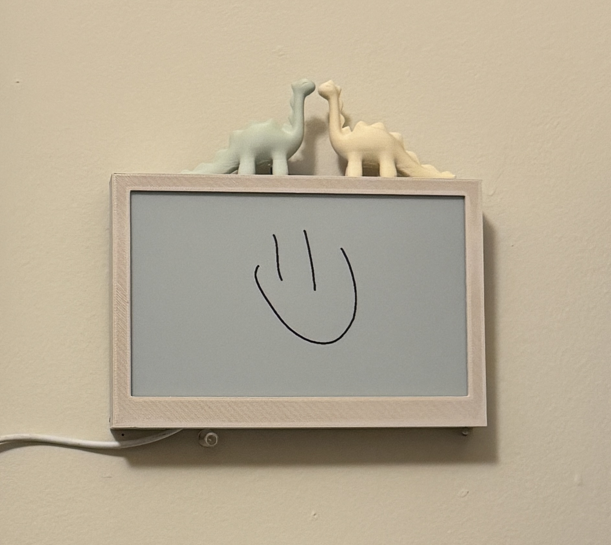

# IoT Projects 🌐🔗📱🏠

<!-- 

  -->

Welcome to my IoT Projects repository! This repository contains various Internet of Things (IoT) projects that I am working on. Each project folder includes all the necessary files, code, and documentation to understand and replicate the projects.

---

## Table of Contents

1. [Pair an ESP01s with the OpenMV Camera](https://github.com/oliviacarino/IoT/tree/main/ESP01s-OpenMV)  
2. [A Remote e-Paper Notepad for Leaving Adorable Messages](https://oliviacarino.github.io/IoT/IMMG) 
3. [Programming a Roomba with Custom Sounds](https://github.com/oliviacarino/IoT/tree/main/Kiramman)   

---

## Pair an ESP01s with the OpenMV Camera

This project provides an internet connection to the OpenMV H7 R1 Camera module using an ESP01s. The folder contains prototype setup instructions, code samples, and example applications.

[Go to Breadboard Kit with OpenMV Cam](./Breadboard-Kit-with-OpenMV-Cam)  

---

## A Remote e-Paper Notepad for Leaving Adorable Messages

<table style="margin: 0;">
  <tr>
    <td></td>
    <td></td>
  </tr>
</table>

A cute, simplistic device that displays messages to your loved ones (or anyone really :)).

[Check it out!](https://oliviacarino.github.io/IoT/IMMG/docs/index.html)  
*Please note this is locked behind a login screen. If you're curious to see a full demo, ping me :)*

---

## Programming a Roomba with Custom Sounds

<!-- 

 -->

-- *in progress* --

---
